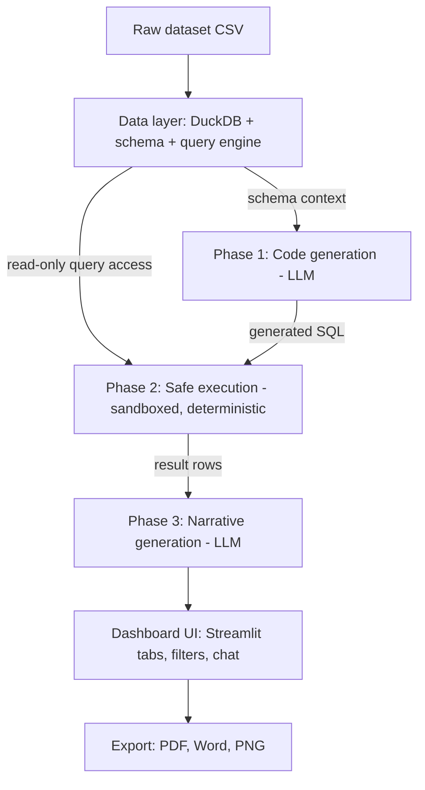

# AI-Powered Data Analytics & Visualization Platform — Project Spec

This is the authoritative spec for this project. Read this in full before writing any code.
It exists so an autonomous coding session can build, test, and validate this project end to
end without re-deriving decisions that have already been made. Do not deviate from the
decisions in this document without flagging the deviation explicitly.

## 1. What this is

A capstone project (Deep Learning, Masters in CSE) that builds a natural-language analytics
platform: a user asks a plain-language question about a dataset, an LLM turns that into
executable SQL, the SQL runs against a local data backend, and the result comes back as both
a chart and an LLM-written narrative answer. The app also supports preset insight generation,
multi-turn conversational follow-ups, and PDF/Word export of any answer.

Grading is out of 13 marks: Task A (data layer) 2.0, Task B (LLM integration) 2.5, Task C
(dashboard) 2.0, Task D (advanced features) 1.5, plus a 5-mark presentation/report component
graded separately. Task B is the single heaviest component and the one most likely to be
probed in Q&A — build it carefully, not quickly.

**Non-negotiable rules from the assignment brief:**
- No pre-built dashboard template or existing analytics app as a starting point — built from scratch.
- No faked or hardcoded LLM responses in the shipped app — all AI calls must be live.
- Single-commit or dump-commit repos are explicitly penalized — commit after each subtask.
- Every function must be understandable and explainable by the team — docstrings are mandatory, not optional.

## 2. Dataset

**Global Superstore** (already downloaded locally). Columns include Order ID, Product
Category, Sub-Category, Customer Segment, Region, Country, Sales, Quantity, Discount,
Profit, Ship Mode, Order Date (~51K rows spanning multiple countries — this is what makes the
geographic choropleth in Task C meaningful).

**Before this file is used anywhere near an LLM prompt:** open the raw CSV and check for a
`Customer Name` column (most Superstore re-uploads have one). Drop or hash it during ingestion
in Task A. No PII may reach a schema-context prompt sent to Gemini or Groq. Treat this as a
hard gate on Task A, not a cleanup step to do later.

Expected local path: `data/raw/global_superstore.csv` (adjust ingestion code to the actual
filename once confirmed).

### How generic should the code be?

The project targets Global Superstore only — the assignment requires one dataset, not a
general-purpose tool. But keep the generic/specific boundary deliberate rather than accidental:

- **Generic (must not reference Superstore column names directly):** `backend/` (ingestion,
  schema introspection, query engine, quality profiling — all already parameter-driven off the
  schema JSON), `llm/pipeline.py` and `llm/sandbox.py`, `viz/auto_select.py` (keys off result
  *shape* — datetime+numeric, categorical+numeric, etc. — never off column identity).
- **Dataset-specific, and that's fine:** the synonym dictionary and the column bindings for
  the six curated charts (choropleth, sunburst, etc.). Don't hide this by hardcoding it inline
  across multiple files — put it in one place: `configs/dataset_config.yaml`, containing the
  synonym map, the file path, and which columns feed each curated chart. Everything else reads
  from this file rather than containing literal column-name strings.

This isn't about building a tool that works on any CSV — that's out of scope. It's about not
having `"Sales"` and `"Region"` typed as string literals in five unrelated files, which would
make the LLM's schema-awareness look more hardcoded than it actually is when the code is
reviewed in Q&A.

## 3. Decided tech stack

| Layer | Choice | Do not substitute without discussion |
|---|---|---|
| Language | Python 3.10+ | |
| Data layer | DuckDB (in-process) | Not a client-server DB, no SQLAlchemy ORM needed |
| Dashboard | Streamlit | Chosen over Dash for build speed; local dev only for now (`streamlit run`), deployment target not yet decided — don't hardcode deployment-specific config |
| LLM primary | Google Gemini 2.5 Flash (Google AI Studio API, free tier) | Use structured/JSON output mode, not free-text parsing |
| LLM fallback | Groq (Llama 3.3 70B or similar, free tier) | Triggered on Gemini error/timeout/rate-limit only |
| SQL validation | `sqlglot` | Parses and validates LLM-generated SQL before execution |
| Charts | Plotly | Required for interactivity + PNG/SVG export |
| Word export | `python-docx` | |
| PDF export | `reportlab` or `weasyprint` | Either is fine |
| Testing | `pytest` | See Section 8 |
| Env/secrets | `python-dotenv` + `.env` (gitignored) | Never commit keys |

No multi-model comparison across LLM providers — scope is Gemini + Groq only, nothing else.

## 4. System architecture



The critical property of this architecture: **the LLM never executes anything.** It only ever
produces text (SQL in Phase 1, narrative in Phase 3). Phase 2 is pure, deterministic, sandboxed
Python that runs *validated* SQL against a *read-only* DuckDB connection. This is what
satisfies the assignment's sandbox requirement (block imports, file access, os/sys, network
calls) by construction rather than by trying to police an arbitrary `exec()` call — SQL syntax
has no `import` statement, no filesystem access, and no socket calls to block in the first place.

Keep this separation strict. If a feature seems to need the LLM to "just run some Python,"
that's a signal to either express it as SQL, or — for Task D's predictive-analytics-style needs
— build a second, much narrower, separately-sandboxed pandas execution path (see Section 6, Task D).

## 5. Repository structure

```
.
├── PROJECT_SPEC.md          # this file
├── PROGRESS.md              # living checklist, see Section 9
├── README.md                # setup instructions, run command, LLM config
├── requirements.txt         # pinned versions
├── .env.example              # documents required env vars, no real values
├── .gitignore                # must include .env, __pycache__, venv/, data/raw/ (large files)
├── configs/
│   └── dataset_config.yaml   # synonym dictionary, file path, curated-chart column bindings
├── data/
│   └── raw/                  # global_superstore.csv lives here (gitignored, large file)
├── app/
│   └── app.py                # Streamlit entrypoint, st.tabs() layout
├── backend/
│   ├── ingest.py              # Task A1: load CSV into DuckDB, dtype handling
│   ├── schema.py               # Task A1: schema introspection -> JSON
│   ├── query_engine.py         # Task A2: groupby_agg(), filtered_query()
│   ├── quality.py               # Task A3: profiling, cleaning, outlier detection (IQR)
│   └── benchmark_perf.py        # Task A4: <500ms timing script
├── llm/
│   ├── client.py                 # generate() with Gemini->Groq failover
│   ├── prompts.py                 # system prompt templates; loads synonym dict from configs/dataset_config.yaml
│   ├── pipeline.py                 # Phase 1/2/3 orchestration + single auto-retry
│   ├── sandbox.py                   # sqlglot validation, SELECT-only enforcement
│   └── memory.py                     # last-5-turn conversation history
├── viz/
│   ├── charts.py                      # the 6-7 chart builders
│   └── auto_select.py                  # result-shape -> chart-type rule table
├── features/
│   ├── anomaly_detection.py             # Task D
│   └── comparative_analysis.py           # Task D
├── export/
│   ├── pdf_export.py
│   └── docx_export.py
├── eval/
│   ├── benchmark_questions.json          # the fixed 10-15 question set + ground truth
│   ├── run_benchmark.py                   # runs the set, scores accuracy, writes results
│   └── results/                            # logged prompt/response pairs + scores over time
└── tests/
    ├── test_backend.py
    ├── test_sandbox_security.py           # exploit-attempt rejection tests
    ├── test_llm_client.py                  # mocked failover behavior
    └── test_integration.py                  # end-to-end: question in -> chart+narrative out
```

## 6. Task-by-task specification

### Task A — Data layer (`backend/`)

- **A1 Ingestion & schema**: load the CSV into DuckDB once at startup. `schema.py` must
  produce a JSON object per column: `{name, dtype, n_unique, n_null, sample_values[≤5]}`. This
  JSON is what gets injected into every LLM prompt in Task B — treat it as a public contract,
  not an internal detail.
- **A2 Query engine**: `groupby_agg(dims, metrics, aggs)` and `filtered_query(filters, dims,
  metrics)`, both returning `(pandas.DataFrame, elapsed_ms)`.
- **A3 Data quality**: missing %, duplicate count, IQR-based outlier counts per numeric
  column. Apply at least two real cleaning steps (e.g. parse `Order Date`, standardize category
  casing). Surface a data-quality summary in the Streamlit UI.
- **A4 Performance**: benchmark script proving filtered aggregation is <500ms on the full
  dataset; log actual numbers to `eval/results/` — don't just assert it in code, produce evidence.

### Task B — LLM integration (`llm/`)

- **B1 Prompt design**: system prompt = schema JSON (from `backend/schema.py`, introspected —
  not hardcoded) + the synonym dictionary loaded from `configs/dataset_config.yaml`
  (`revenue→Sales`, `country→Region`, etc.) + 2-3 few-shot question→SQL examples. Test against
  ≥10 varied phrasings and log the results.
- **B2 Pipeline**: Phase 1 (Gemini/Groq generates SQL as structured JSON `{"sql": ..., "reasoning": ...}`) →
  Phase 2 (`sandbox.py` validates with `sqlglot`: single `SELECT` only, reject `ATTACH`,
  `PRAGMA`, `INSTALL`, `COPY`, any DDL/DML, multiple statements; execute against a **read-only**
  DuckDB connection) → Phase 3 (LLM receives the result + original question, returns a
  Markdown-formatted narrative). On Phase 2 failure, send the error back to the LLM once for a
  single retry, then surface a clean failure message — don't retry indefinitely.
- **B3 Insight generation**: three preset prompts — Dataset Overview, Trend/Comparison
  Analysis, Anomaly/Outlier Report — each combining a curated aggregation with LLM narrative.
- **B4 Conversational context**: keep the last 5 `(question, sql, answer)` tuples in
  `st.session_state`; inject them into the prompt for follow-up questions; add a reset button.
- **B5 Reliability**: validate LLM responses for empty output, truncated output
  (`finish_reason == "length"` equivalent), and timeouts. Show a loading indicator with elapsed
  time during inference. This is also where the Gemini→Groq failover lives — implement it as:
  try Gemini, on error/timeout/rate-limit fall back to Groq transparently, log which provider
  actually served each request.

### Task C — Dashboard (`app/`, `viz/`)

- **C1 Architecture**: `st.tabs()` for Overview / Exploration / AI Assistant (not the
  multipage `pages/` folder — that resets session state across pages, which breaks persistent
  global filters). Filters live in `st.sidebar`, backed by `st.session_state` so state survives
  reruns. Usable at 1280px+.
- **C2 Visualization suite**: build at least 6 of: time series (dual-axis revenue/profit),
  choropleth by Country/Region, correlation heatmap, box plot of profit by category, sunburst
  of Category→Sub-Category→Segment, scatter of Discount vs Profit with a regression line,
  stacked bar of Region×Category with drill-down. Consistent color scheme, titles, tooltips,
  axis labels on every chart.
- **C3 AI-driven visualization**: when the NL pipeline returns a DataFrame, auto-select a
  chart type from result shape (datetime+numeric → line; categorical+numeric → bar;
  numeric+numeric → scatter; ≥3 columns → table). Let the user override via a dropdown. Every
  AI-generated chart gets a one-sentence LLM-generated caption.
- **C4 Export**: one-click PDF export of an AI Assistant answer (dataset metadata + applied
  filters + narrative + chart image), a Word export option, and PNG/SVG export per chart.

### Task D — Advanced features (choose 2, **decided: Anomaly Detection + Comparative Analysis**)

- **Anomaly Detection**: reuse the IQR outlier logic from A3, extend it to flag specific rows
  in the dashboard, and have the LLM generate a plain-language explanation of each flagged
  anomaly. Low marginal cost since the detection logic already exists from Task A.
- **Comparative Analysis**: let the user pick two regions or two date ranges, run
  `filtered_query()` twice, and have the LLM generate a structured side-by-side comparison
  narrative alongside a paired visualization.

If either feature turns out to be a poor fit once real data is in hand, swap it — this is a
recommendation based on integration cost, not a hard requirement. Flag any swap explicitly
rather than silently changing scope.

## 7. Sandbox security requirements (Task B2, testable)

The SQL execution path must reject, with tests proving it:
- Any statement that isn't a single `SELECT`
- `ATTACH`, `DETACH`, `PRAGMA`, `INSTALL`, `LOAD`, `COPY`, `EXPORT`
- Any DDL (`CREATE`, `DROP`, `ALTER`) or DML (`INSERT`, `UPDATE`, `DELETE`)
- Multiple statements separated by `;`
- Any attempt to read files (`read_csv`, `read_parquet` pointed outside the loaded table)

If Task D or any future feature needs a pandas/`exec()` path (e.g. for a regression model),
it must be a **separate, narrower** sandbox: AST-walk the generated code, reject `Import`/
`ImportFrom` nodes, reject calls to `eval`/`exec`/`open`/`__import__`, reject dunder attribute
access, and run with a `builtins` dict that simply omits `os`, `sys`, `subprocess`, `socket`,
`open`. Write exploit-attempt tests for this path too (e.g. `__import__('os').system(...)`,
`().__class__.__bases__`).

## 8. Testing requirements

Write tests as each task is implemented, not at the end:
- `test_backend.py`: schema extraction correctness, query engine outputs (known small
  fixture, not the full dataset), the <500ms performance assertion.
- `test_sandbox_security.py`: every rejection case in Section 7, both SQL and any pandas path.
- `test_llm_client.py`: mock the Gemini and Groq SDK calls; assert failover triggers on a
  simulated timeout/error and that a successful Gemini call never touches Groq.
- `test_integration.py`: at least one full pipeline run (question → SQL → result → narrative)
  against a small fixture dataset, asserting the shape of the final output rather than exact
  LLM wording.
- Streamlit's built-in `AppTest` utility is a reasonable option for basic UI smoke tests
  (does the app boot, do the tabs render) — use it if it fits cleanly, don't force it.

Run the full suite before considering any task "done." A task is not complete if its tests
don't exist yet.

## 9. Working agreement for coding sessions

- Maintain `PROGRESS.md` at the repo root as a running checklist of subtasks (A1, A2, ...,
  D2) with status (`not started` / `in progress` / `done + tested`). Update it at the end of
  every session — a fresh session has no memory of prior ones beyond what's written down.
- One subtask, one commit, with a message referencing the subtask ID (e.g. `A2: implement
  filtered_query with elapsed-time logging`). No end-of-day dump commits.
- Build in dependency order: A before B (B needs the schema), B before C's AI-driven chart
  selection (C needs a result DataFrame to shape-detect on), D last (it reuses A3 and A2).
- `.env` is created locally from `.env.example` and is never committed. Verify `.gitignore`
  includes it before the first commit, not after.
- Every module gets a module-level docstring explaining its purpose; every function gets a
  docstring. This isn't style preference — the assignment explicitly requires it and Q&A will
  probe whether the team can explain any given line.

## 10. The benchmark question set (Task B1/B5, feeds the written report)

Before tuning prompts, draft `eval/benchmark_questions.json`: 10-15 fixed natural-language
questions against the actual Global Superstore schema, each with a hand-computed ground-truth
answer, spanning these categories:
- Simple aggregation (e.g. "total sales by region")
- Filtered aggregation (e.g. "average profit for orders with more than 20% discount")
- Synonym resolution (using informal terms not matching column names verbatim)
- Multi-condition filters (combining ≥2 filters)
- Out-of-scope / unanswerable questions, to test that the system fails gracefully rather than hallucinating

Run this exact set through `run_benchmark.py` every time the prompt changes, and log results.
This produces both the accuracy table the written report needs and, ideally, a small ablation
(schema-only prompt vs +synonyms vs +few-shot vs +conversation history) showing which prompt
components actually moved accuracy — that ablation is the most report-worthy result in the
whole project and costs almost nothing extra once the benchmark harness exists.

## 11. Explicitly out of scope right now

- Deployment/hosting target — not decided yet, don't hardcode Streamlit Community Cloud vs
  Hugging Face Spaces vs anything else into the app config. Keep it deployment-agnostic
  (env-var-driven config, no hardcoded local paths outside `data/`).
- Multi-LLM-provider comparison beyond Gemini/Groq — explicitly descoped, don't add OpenRouter
  or other providers without being asked.
